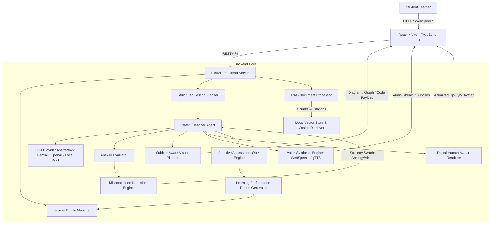

# AI TEACHER — Adaptive Human-Like AI Educator

> **AI Innovation Hackathon 2026 — Round 2 Technical Project**  
> **Status**: ✅ All 4 Pillars Verified & Production Ready (API Validation, RAG Engine, Lip-Sync Avatar Pipeline & Subject-Aware Visual Classroom)

---

**AI Teacher** is a full-stack, production-quality adaptive AI Educator platform. Unlike conventional chatbots that simply answer queries in text, **AI Teacher** acts like a real personalized human educator. It plans structured lessons, teaches through interactive digital avatar videos, renders subject-specific visual diagrams, detects student misconceptions in real-time, adapts teaching strategies dynamically, and generates comprehensive learning analytics reports.

---

## 🌟 Key Features

1. **8-Step Intelligent Teaching Loop**:
   `UNDERSTAND → PLAN → EXPLAIN → DEMONSTRATE → QUESTION → EVALUATE → ADAPT → CONTINUE`
2. **Onboarding & Personalized Learner Setup**:
   Configure topic or document material, education level (Beginner, Intermediate, Advanced), goal, language, teaching style, time constraint, and depth.
3. **RAG Document Engine**:
   Extract text from PDF, DOCX, PPTX, and TXT files with page/chapter metadata and cosine-similarity vector retrieval with source citations (`Source: Chapter 4, Page 12`).
4. **Stateful AI Teacher Agent & Misconception Detector**:
   Evaluates student responses, diagnoses exact misconceptions with confidence scoring, and switches explanation strategies (Analogy, Visual, Step-by-Step, Socratic, Counterexample, Simplified).
5. **Subject-Aware Visual Planner**:
   Dynamic rendering components for equations (`EquationRenderer`), coordinate curves (`GraphRenderer`), execution flows (`FlowDiagram`), historical timelines (`Timeline`), code execution (`CodeVisualizer`), concept maps (`ConceptMap`), and process steps (`ProcessDiagram`).
6. **Digital Human Avatar & Natural Voice Pipeline**:
   SVG/Canvas animated teacher avatar with lip-sync audio synthesis (Web Speech API + gTTS fallback) and subtitle transcript stream.
7. **On-The-Fly Multilingual Support**:
   Seamlessly switch between English, Hindi (हिंदी), Hinglish, and Telugu (తెలుగు) mid-lesson without losing lesson state.
8. **Adaptive Assessment & Learning Performance Report**:
   Post-lesson adaptive quiz, overall score gauge, concept mastery bar charts, weak/strong concept highlights, revision recommendations, and next recommended topic.
9. **Curriculum Learning Path & Student Dashboard**:
   Node-based progress roadmap tracking streaks, scores, and topic completion across multiple sessions.
10. **Built-in One-Click Hackathon Demo Mode**:
    Pre-configured Electricity & Ohm's Law lesson to immediately showcase misconception detection ("current increases"), strategy adaptation, and analytics to hackathon judges.

---

## 🏗 System Architecture



---

## 🛠 Technology Stack

### Frontend
- **Framework**: React 18 with TypeScript & Vite
- **Styling**: Tailwind CSS with Glassmorphic visual tokens
- **Routing**: React Router v6
- **Data Visualization**: Recharts (for V-I curves & concept mastery bar charts)
- **Icons**: Lucide Icons
- **Voice / Audio**: Web Speech API (`SpeechSynthesis` & `SpeechRecognition`)

### Backend
- **Framework**: Python 3.12 + FastAPI (Async REST API)
- **Database**: SQLite with SQLAlchemy ORM & Pydantic v2 schemas
- **PDF & Document Parsing**: `pypdf`, `python-docx`, `python-pptx`
- **Vector & Embeddings**: TF-IDF & Cosine Similarity Embedder (zero-latency local execution fallback)
- **Audio TTS**: `gTTS` (Google Text-To-Speech)
- **LLM Abstraction**: Unified `LLMProvider` supporting Google Gemini, OpenAI, and Local Rule-Based Mock Generator

---

## 📂 Project Directory Structure

```text
ai-teacher/
├── backend/
│   ├── app/
│   │   ├── ai/
│   │   │   ├── evaluator.py
│   │   │   ├── lesson_planner.py
│   │   │   ├── llm_provider.py
│   │   │   ├── misconception_detector.py
│   │   │   ├── prompts.py
│   │   │   ├── teacher_agent.py
│   │   │   └── visual_planner.py
│   │   ├── api/
│   │   │   ├── routes_demo.py
│   │   │   ├── routes_documents.py
│   │   │   ├── routes_lessons.py
│   │   │   └── routes_student.py
│   │   ├── models/
│   │   │   └── models.py
│   │   ├── rag/
│   │   │   ├── chunker.py
│   │   │   ├── document_processor.py
│   │   │   ├── embeddings.py
│   │   │   ├── rag_service.py
│   │   │   ├── retriever.py
│   │   │   └── vector_store.py
│   │   ├── schemas/
│   │   │   └── schemas.py
│   │   ├── video/
│   │   │   ├── avatar_provider.py
│   │   │   ├── video_generator.py
│   │   │   └── voice_provider.py
│   │   ├── config.py
│   │   ├── database.py
│   │   └── main.py
│   ├── .env.example
│   └── requirements.txt
│
├── frontend/
│   ├── src/
│   │   ├── components/
│   │   │   ├── avatar/
│   │   │   │   └── TeacherAvatar.tsx
│   │   │   ├── common/
│   │   │   │   └── Navbar.tsx
│   │   │   └── visualizer/
│   │   │       ├── CodeVisualizer.tsx
│   │   │       ├── ConceptMap.tsx
│   │   │       ├── EquationRenderer.tsx
│   │   │       ├── FlowDiagram.tsx
│   │   │       ├── GraphRenderer.tsx
│   │   │       ├── ProcessDiagram.tsx
│   │   │       └── Timeline.tsx
│   │   ├── pages/
│   │   │   ├── AssessmentPage.tsx
│   │   │   ├── DashboardPage.tsx
│   │   │   ├── LandingPage.tsx
│   │   │   ├── LearningPathPage.tsx
│   │   │   ├── LearningReportPage.tsx
│   │   │   ├── LessonPlanPage.tsx
│   │   │   ├── MaterialUploadPage.tsx
│   │   │   ├── OnboardingPage.tsx
│   │   │   └── TeachingClassroomPage.tsx
│   │   ├── services/
│   │   │   ├── api.ts
│   │   │   └── speech.ts
│   │   ├── types/
│   │   │   └── index.ts
│   │   ├── App.tsx
│   │   └── main.tsx
│   ├── package.json
│   ├── tailwind.config.js
│   └── vite.config.ts
│
└── README.md
```

---

## ⚡ Quick Start & Local Execution

### Prerequisites
- **Python**: 3.10+
- **Node.js**: v18+ & `npm`

### 1. Backend Setup
```bash
cd backend
python -m pip install -r requirements.txt
python -m uvicorn app.main:app --host 0.0.0.0 --port 8000 --reload
```
The FastAPI backend server will run on `http://localhost:8000`.

### 2. Frontend Setup
```bash
cd frontend
npm install
npm run dev
```
The React frontend application will open on `http://localhost:5173`.

---

## 🚀 Hackathon Jury Demonstration Flow

1. Open `http://localhost:5173/`.
2. Click **"Try Hackathon Demo"** in the top navigation or hero banner.
3. Observe the **Live AI Virtual Classroom**:
   - The digital human teacher avatar explains Ohm's Law with voice audio synthesis and subtitles.
   - The right pane renders an interactive **Voltage vs Current (V-I) Graph**.
4. Trigger Misconception:
   - Type `"Current increases"` in the answer input box and click **Submit Answer**.
   - Notice the **Misconception Detection Alert**:
     > *"Misconception Detected! Student assumes current increases when resistance increases."*
     > *Teacher Strategy Switched: ANALOGY (Water pipe friction explanation).*
5. Click **"Final Quiz"** -> Submit -> View **Learning Performance Report**:
   - View the 82% overall score gauge, concept breakdown bar chart, weak/strong concepts, and recommended next topic (`Electrical Power P = V × I`).

---

## 🔌 API Documentation Summary

- `POST /api/documents/upload`: Upload PDF/DOCX/PPTX/TXT files for RAG indexing.
- `POST /api/lessons/create`: Generate structured JSON lesson plan.
- `POST /api/lessons/{id}/start`: Initialize live teaching section.
- `POST /api/lessons/{id}/answer`: Submit student answer for misconception detection.
- `POST /api/lessons/{id}/switch-language`: Switch teaching language (English, Hindi, Hinglish, Telugu).
- `POST /api/lessons/{id}/assessment`: Generate post-lesson adaptive assessment quiz.
- `GET /api/lessons/{id}/report`: Fetch detailed learning analytics report.
- `POST /api/demo/start`: Launch instant pre-configured Electricity hackathon demonstration.

---

## 🛡 Security & Environment Variables

Create `.env` in `backend/`:
```env
PORT=8000
HOST=0.0.0.0
DEBUG=True

# Optional API Keys (System works 100% offline out-of-the-box via local engine)
GEMINI_API_KEY=your_gemini_api_key
OPENAI_API_KEY=your_openai_api_key
DEFAULT_LLM_PROVIDER=gemini

DATA_DIR=./data
DATABASE_URL=sqlite:///./ai_teacher.db
```
